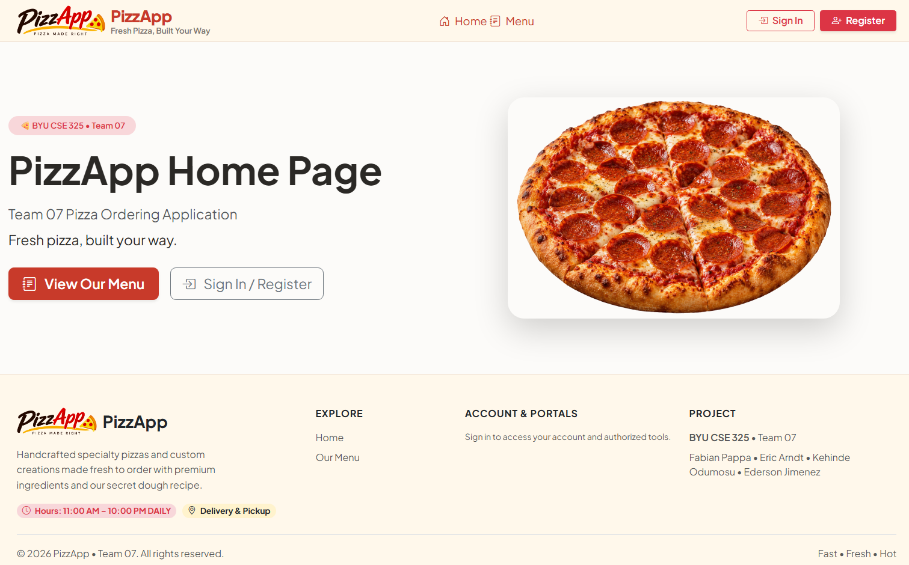

# PizzApp — CSE 325 Team 07

PizzApp is a full-stack pizza ordering application developed by Team 07 for BYU-Idaho CSE 325.

The application allows customers to browse specialty pizzas, build custom pizzas, manage a shopping cart, place pickup or delivery orders, track active orders, and review previous orders. Staff and administrator accounts provide additional tools for order fulfillment, menu management, staff management, store settings, and sales reporting.

## Live Application

https://cse325-team07.onrender.com

## Project Board

Team planning and task tracking:

[Team 07 Trello Board](https://trello.com/b/6aa199737e69596e917c575a)

## Team Members

- Fabian Pappa
- Eric Arndt
- Kehinde Odumosu
- Ederson Jimenez

## Major Features

### Customer

- Register and sign in with a customer account
- Browse database-backed specialty pizzas
- Build custom pizzas with size, crust, sauce, cheese, and topping selections
- Add pizzas to a shopping cart and adjust quantities
- Choose pickup or delivery during checkout
- View calculated subtotal, tax, delivery fee, and order total
- Track active order status
- Cancel eligible active orders with a cancellation reason
- View past orders and receipts
- Reorder previous purchases using current menu pricing
- Manage account profile and password

### Staff

- View active customer orders
- Update orders through the fulfillment workflow
- Process both pickup and delivery orders
- View order details needed for fulfillment

### Administrator

- Access the Staff Dashboard
- Edit specialty pizza information and availability
- Manage staff accounts and roles
- Reset staff passwords
- Enable or disable staff accounts
- Configure store settings such as:
  - Operating hours
  - Delivery radius
  - Delivery fee
  - Sales tax percentage
- View daily sales information
- View 30-day sales summary information
- View top-selling pizza information

## Order Workflow

PizzApp supports the following internal order statuses:

1. Received
2. Baking
3. Ready
4. Out for Delivery
5. Completed
6. Cancelled

Customer-facing status labels vary depending on whether an order is for pickup or delivery.

## Technology Stack

- .NET 10
- ASP.NET Core
- Blazor Web App with Interactive Server rendering
- Entity Framework Core 10
- ASP.NET Core Identity
- PostgreSQL
- Npgsql Entity Framework Core provider
- Neon PostgreSQL for the hosted database
- Bootstrap / Bootstrap Icons
- Docker
- Render for production hosting

## Database and Authentication

PizzApp uses Entity Framework Core with PostgreSQL for persistent application data.

The application uses ASP.NET Core Identity for authentication and role management. Supported application roles include:

- Customer
- Staff
- Administrator

The database is initialized at application startup with required roles, menu data, and development/demo data when appropriate.

## Local Development

### Requirements

Install:

- .NET 10 SDK
- PostgreSQL, or access to a PostgreSQL-compatible hosted database such as Neon

### Clone the Repository

git clone https://github.com/Pappafabian17/cse325-Team07.git

### Configure the Database

PizzApp reads its PostgreSQL connection string from:

ConnectionStrings:DefaultConnection

For local development, the connection string can be stored using .NET User Secrets or another ASP.NET Core configuration provider.

Example:

dotnet user-secrets set "ConnectionStrings:DefaultConnection" "Host=YOUR_HOST;Database=YOUR_DATABASE;Username=YOUR_USERNAME;Password=YOUR_PASSWORD"

If no `DefaultConnection` value is supplied, the application is configured to fall back to a local PostgreSQL development database named `pizzapp_dev`.

### Restore and Run

From the repository root:

dotnet restore .\PizzApp\PizzApp.csproj
dotnet build .\PizzApp\PizzApp.csproj
dotnet run --project .\PizzApp\PizzApp.csproj

Open the local URL displayed by ASP.NET Core in the terminal.

## Project Structure

```text
PizzApp/
├── Components/
│   ├── Layout/          Navigation and shared layout components
│   └── Pages/           Customer, staff, and administrator pages
├── Data/                EF Core database context, migrations, and seed data
├── Endpoints/           Authentication endpoints
├── Models/              Application and database models
├── Services/            Application services such as shopping-cart state
├── wwwroot/             Static assets, images, CSS, and client resources
├── Program.cs           Application startup and service configuration
└── PizzApp.csproj       .NET project configuration
```

## Deployment

The production application is containerized with Docker and deployed through Render.

The Docker build:

1. Restores the .NET project
2. Publishes the application in Release mode
3. Runs the published application using the ASP.NET Core .NET 10 runtime

Production database connectivity is provided through environment configuration rather than credentials stored in the repository.

## Current PizzApp Home Page



## Course

**BYU-Idaho CSE 325 — Team 07**
